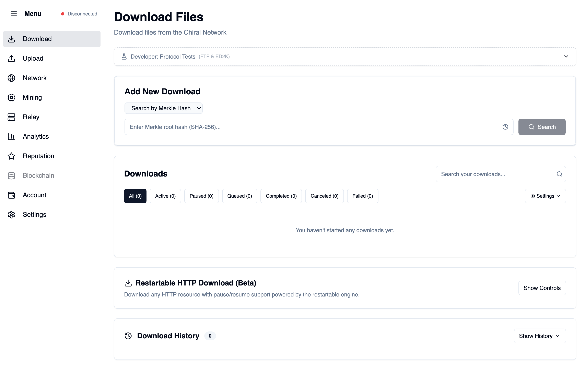
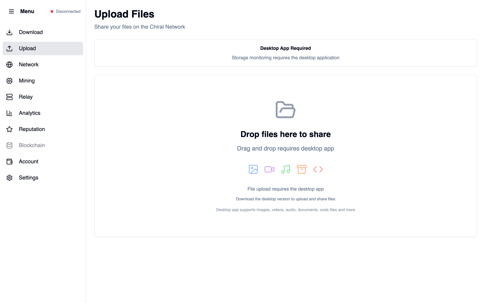
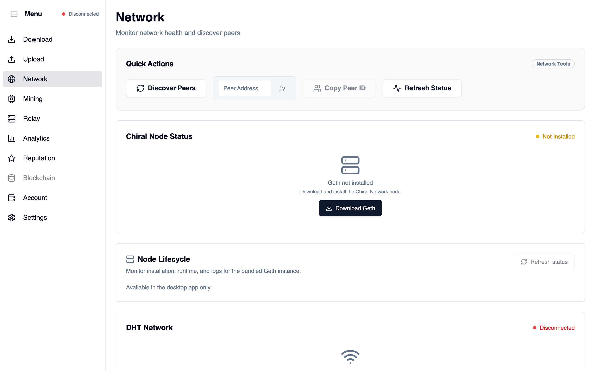
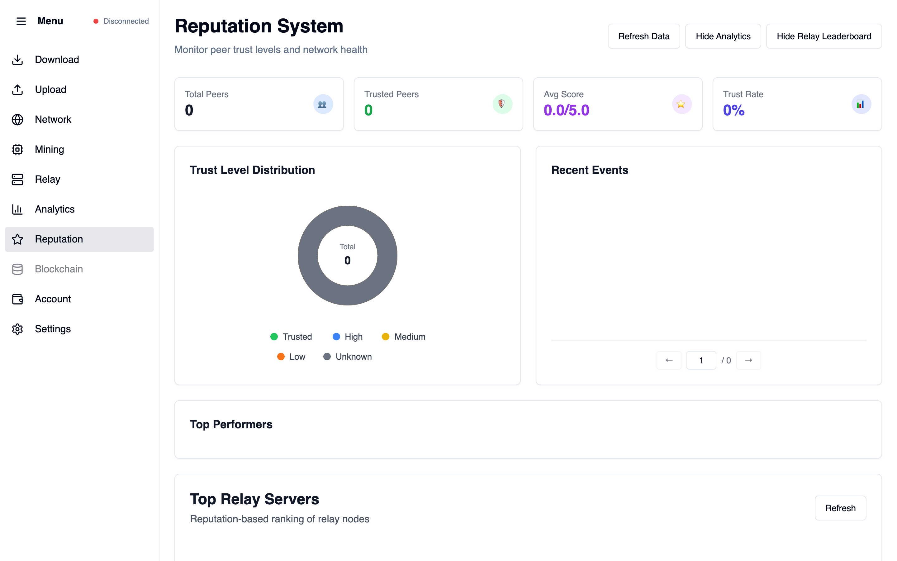
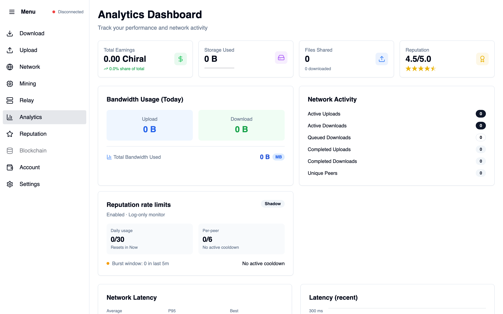
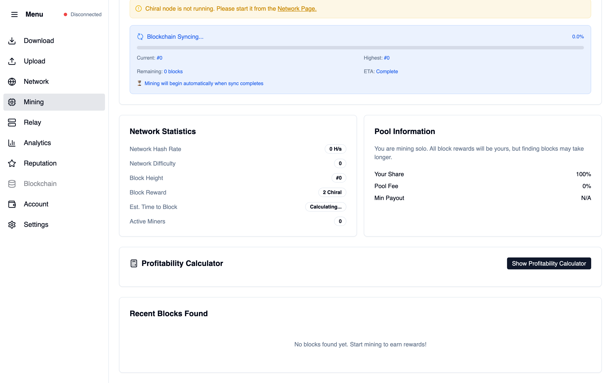
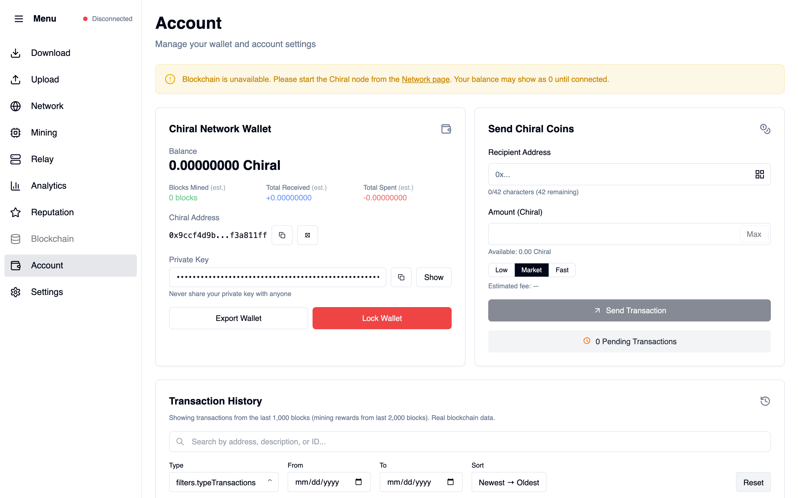
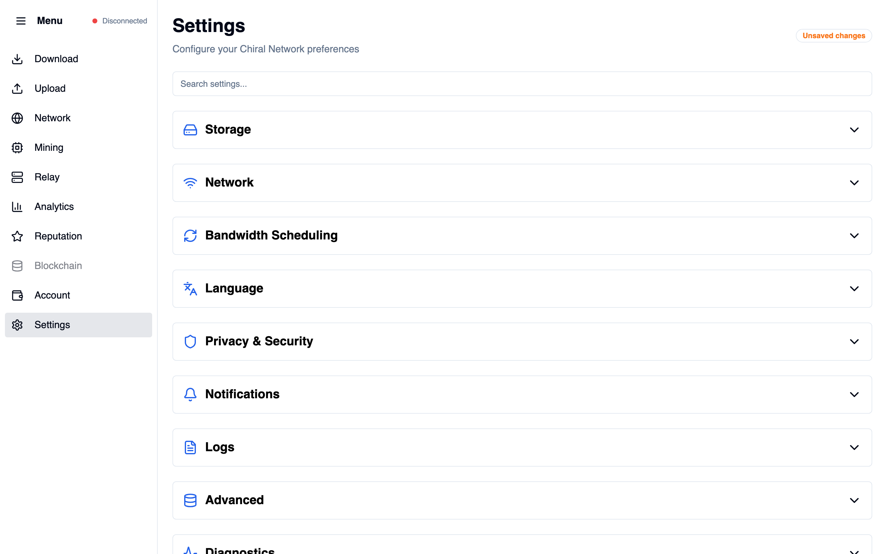
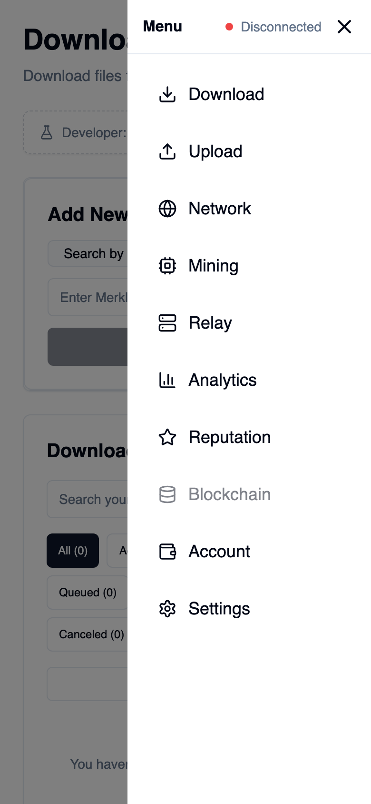

# Chiral Network

> **Decentralized P2P File Sharing Platform**

Chiral Network is a BitTorrent-like peer-to-peer file storage and sharing system that combines blockchain technology with DHT-based distributed storage. Built with privacy, security, and legitimate use in mind.

[](LICENSE)
[](https://chiral-network.vercel.app/)
[](https://github.com/cdandeniya/chiral-network/actions)

## Live Demo

**Try it in your browser:** [**chiral-network.vercel.app**](https://chiral-network.vercel.app/)

The hosted web build showcases the full UI (downloads, network monitoring, reputation, wallet, settings, and more). P2P file transfers, DHT connectivity, and native system features require the **desktop app** built with Tauri.

| | |
|---|---|
| **Web demo** | [https://chiral-network.vercel.app/](https://chiral-network.vercel.app/) |
| **Source** | [github.com/cdandeniya/chiral-network](https://github.com/cdandeniya/chiral-network) |
| **Desktop builds** | [GitHub Releases](https://github.com/cdandeniya/chiral-network/releases) *(when published)* |

## Screenshots

Captured from the [live demo](https://chiral-network.vercel.app/) — each image shows a different app page (sidebar + main content). On first visit, click **Create Test Wallet** to explore without setup.

### Download & file search

Merkle hash / magnet / torrent / ED2K / FTP search, download queue filters, and restartable HTTP downloads.



### Shared files (upload / seeding)

Drag-and-drop seeding UI and shared-files list for instant network availability.



### Network & DHT

Peer discovery, Geth node status, DHT connection controls, and network metrics.



### Reputation system

Trust-level distribution, peer scoring, analytics cards, and relay leaderboard.



### Analytics

Bandwidth caps, storage usage, and network activity dashboard.



### Mining

Mining controls, profitability calculator, and hash-rate monitoring.



### Wallet & account

Wallet balance, send transactions, transaction history, 2FA, and blacklist management.



### Settings

App configuration for storage, networking, privacy, proxy, and relay options.



<details>
<summary>Mobile navigation menu</summary>



</details>

## Tech Stack

| Layer | Technologies |
|-------|----------------|
| **Frontend** | Svelte 5, TypeScript, Tailwind CSS, svelte-i18n |
| **Desktop** | Tauri 2 (Rust) |
| **P2P** | libp2p, Kademlia DHT, WebRTC, Circuit Relay v2, AutoNAT |
| **Blockchain** | Ethereum-compatible node (Geth), HD wallets (BIP39/BIP32) |
| **Security** | AES-256-GCM encryption, PBKDF2, HMAC stream auth |

## Features

- **Fully decentralized** — DHT-based peer discovery, no central file servers
- **Multi-source downloads** — Parallel chunks from multiple peers with failover
- **Reputation system** — Trust-based peer selection and relay leaderboard
- **Privacy-focused** — SOCKS5 proxy, anonymous mode, encrypted transfers
- **Cross-platform desktop** — Native app via Tauri (Windows, macOS, Linux)
- **Internationalization** — English, Spanish, Russian, Chinese, Korean, and more

## Quick Start

### Web (UI preview)

```bash
git clone https://github.com/cdandeniya/chiral-network.git
cd chiral-network
npm install
npm run dev
```

Open `http://localhost:1420` — use **Create Test Wallet** to explore the app without setting up a full wallet.

### Desktop (full P2P features)

```bash
npm install
npm run tauri:dev    # development
npm run tauri:build  # production build
```

### Deploy web demo (Vercel)

The repo includes `vercel.json` for static hosting:

```bash
npm run build
npx vercel --prod
```

See [Web Deployment](docs/DEPLOYMENT.md) for Netlify, GitHub Pages, and other options.

## Documentation

- **[User Guide](docs/user-guide.md)** — End-user documentation
- **[Developer Setup](docs/developer-setup.md)** — Dev environment
- **[System Overview](docs/system-overview.md)** — Architecture and concepts
- **[Web Deployment](docs/DEPLOYMENT.md)** — Hosting for portfolio / resume
- **[Full docs index](docs/index.md)**

## Contributing

Contributions are welcome. See [Contributing Guide](docs/contributing.md) and [Roadmap](docs/roadmap.md).

## Troubleshooting

**Can't connect to network?** Check firewall settings, DHT status on the Network page, and restart the desktop app.

**Files not downloading?** Verify the file hash, confirm seeders are online, and review bandwidth limits in Settings.

**Mining not starting?** Ensure Geth is initialized and a mining address is configured (desktop only).

More: [User Guide — Troubleshooting](docs/user-guide.md#troubleshooting)

## License

MIT — see [LICENSE](LICENSE).

## Disclaimer

Chiral Network is designed for legitimate file storage and sharing. Users are responsible for ensuring they have the rights to share any content they upload.

---

**Built for a decentralized, privacy-focused future**

[Live demo](https://chiral-network.vercel.app/) · [Documentation](docs/index.md) · [Contributing](docs/contributing.md) · [License](LICENSE)
